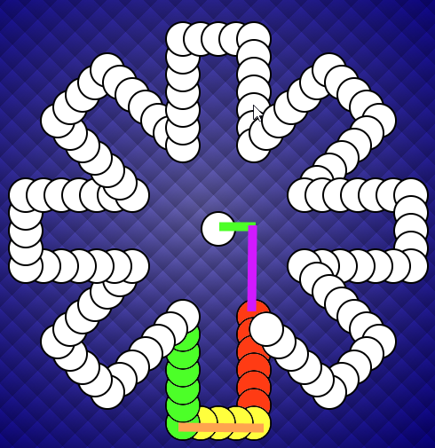

# Keezenspel

The construction of the Keezenspel board happens as follows:
The distance between each cell is constant.
A Cell has a radius R and there is a distance between the Cells D.

The orange line is then 4D+4R long
The arm from the first red dot to the first yellow dot is 6D+6R

The first red dot is the starting point from which the boardsection is constructed.
The green line is half the orange line (2D+2R) and does not depend on the number of players.
The purple line PL is then: PL = tan(alpha)*GL where alpha=90-180/n
